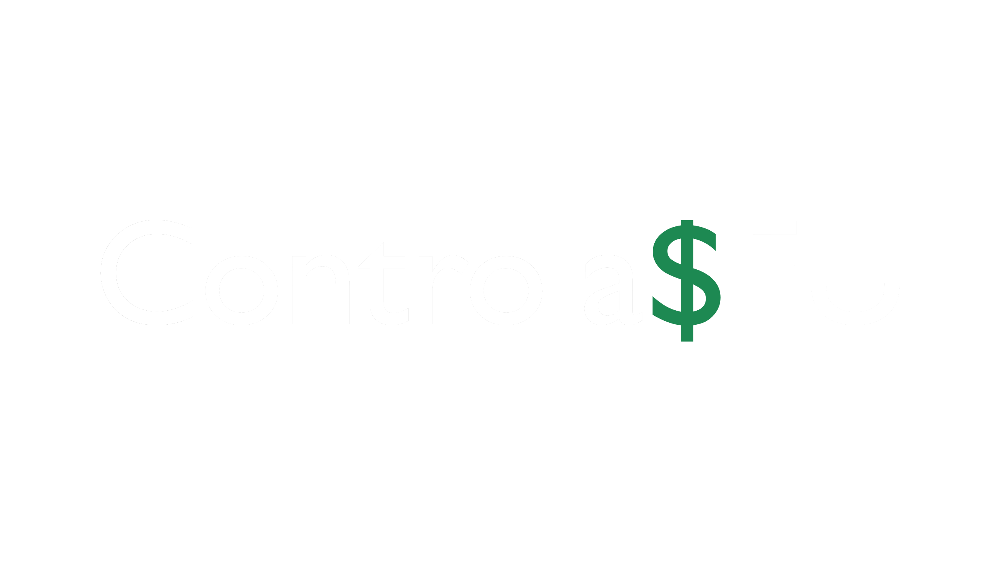

# Projeto **"Controla$EU"**

 

**Autores:**

[Arthur Cabral](https://github.com/Abcabral827), [Gabriel Campanhã](https://github.com/GabrielCampas), [Guilherme Claro Pereira](https://github.com/guipereiradev), [João Guilherme Pascolat](https://github.com/joaoguidias).

# Sumário:

- [Objetivo](#objetivo)
- [Metodologias](#metodologias)
- [Requisitos](#requisitos-do-projeto)
  - [Requisitos Funcionais:](#-requisitos-funcionais-rf)
  - [Requisitos Não-Funcionais:](#-requisitos-não-funcionais-rnf)
- [Estudo de Viabilidade](#estudo-de-viabilidade-do-projeto)
  - [Viabilidade Técnica:](#1-viabilidade-técnica)
  - [Viabilidade Financeira:](#2-viabilidade-financeira)
  - [Viabilidade Operacional:](#3-viabilidade-operacional)
  - [Viabilidade de Mercado:](#4-viabilidade-de-mercado)
- [Regras de Negócio](#regras-de-negócio)
- [Design](#design-do-projeto)
  - [Paleta de Cores](#-paleta-de-cores)
  - [Wireframes](#-wireframes)
  - [Tipografia](#-tipografia)
  - [Protótipo](#-protótipo-do-projeto)
- [Referências e Fontes](#referências-e-fontes-utilizadas)

# **Objetivo**

O projeto _”Controla$EU”_ é focado em auxiliar pessoas jurídicas/físicas (especialmente jovens) a assumirem o controle de suas finanças de forma simples e intuitiva. O projeto foi criado pois notamos, através de dados e notícias, que o número de indivíduos que não conseguem monitorar seu dinheiro de forma prudente e responsável vem crescendo ao longo dos anos, e, dentre esses indivíduos, jovens pertencentes à chamada _"Geração Z"_ acabam se destacando. Como o site da [Folha de Pernambuco](https://www.folhape.com.br) mostra [nesta matéria](https://www.folhape.com.br/colunistas/folha-financas/quase-metade-da-geracao-z-nao-controla-suas-financas-diz-pesquisa/51045), quase metade da _"Geração Z"_ **não** controla suas finanças.

# **Metodologias**

Para esse projeto serão usadas as linguagens de programação HTML 5, CSS 3, JavaScript, frameworks como Bootstrap, prototipagem de alta fidelidade no Figma e — para integração com banco de dados — será usada a linguagem PHP. Os bancos de dados usados serão MariaDB e MySQL. Também será usada a tecnologia Git e GitHub a fim de versionamento do projeto.

[Voltar ao sumário.](#sumário)

# **Requisitos do Projeto.**

## – Requisitos Funcionais (RF).

- **RF01 – Realizar cadastros:**
  O sistema deve permitir que os usuários criem contas e realizem cadastros de pessoa física ou jurídica (Nome, email, CPF, telefone, data de nascimento).
- **RF02 – Realizar logins:**
  O sistema deve permitir guardar informações dos usuários e utilizá-las para realizar o login dos mesmos (Nome de usuário e senha).
- **RF03 – Controlar receitas:**
  O sistema deve permitir o usuário cadastrar e registrar suas receitas e transações a fim de acompanhá-las e as monitorar (Categoria, valor e data das receitas).
- **RF04 – Controlar despesas:**
  O sistema deve permitir com que o usuário documente e organize suas despesas de acordo com sua preferência, buscando mais organização (Categoria, valor e data das despesas).
- **RF05 – Organizar orçamentos:**
  O sistema deve permitir com que o usuário crie e organize seus orçamentos mensais e anuais, notificando-o quando próximo de seu limite (Nome do orçamento, data), exibindo despesas e receitas por tipo e calculando saldos.
- **RF06 – Criar metas:**
  O sistema deve permitir que o usuário defina suas próprias metas de economia ou de investimentos, a fim de acompanhá-las e planejar suas despesas de forma inteligente.
- **RF07 – Notificar o usuário:**
  O sistema deve notificar o usuário sobre coisas como contas a pagar, orçamentos estourados, transações e quando próximo de seu limite.
- **RF08 - Exibir histórico com filtragem::**
  O sistema deve permitir que o usuário visualize o histórico de suas despesas, receitas, orçamentos e metas.

## – Requisitos Não Funcionais (RNF).

- **RNF01 – Incluir autenticação de dois fatores (2FA):**
  O sistema deve exigir a autenticação de dois fatores ao login do usuário e em quaisquer transações financeiras.
- **RNF02 – Criptografar dados:**
  O sistema deve proteger, sem nenhuma exceção, todas as informações pessoais de seus usuários como senhas e dados bancários, tanto durante o uso do sistema quanto em repouso.
- **RNF03 – Apresentar dados precisos:**
  O sistema deve mitigar a taxa de erro durante a exibição de saldos e investimentos.
- **RNF04 – Apresentar boa compatibilidade:**
  O sistema deve ser funcional em diferentes navegadores, como Firefox, Chrome, Edge, dentre outros.
- **RNF05 – Intuitivo e de fácil navegação:**
  O sistema deve apresentar navegação interna intuitiva e consistente, a fim de confortar e satisfazer o usuário.
- **RNF06 – Boa performance:**
  O sistema e suas diferentes páginas devem carregar e salvar informações de maneira rápida.

[Voltar ao sumário.](#sumário)

# Estudo de Viabilidade do Projeto.

## 1. Viabilidade Técnica.

Projeto viável, com tecnologias gratuitas open source que suprem todas as necessidades.

## 2. Viabilidade Financeira.

Projeto viável, com médio ou pouco investimento.

## 3. Viabilidade Operacional.

Projeto viável, que visa melhorar a vida financeira do usuário com curva de aprendizado mínimo.

## 4. Viabilidade de Mercado.

Projeto não tão viável, visa público-alvo pouco explorado porém há empresas já consolidadas no mercado ([_Organizze_](https://www.organizze.com.br/), [_Mobills_](https://www.mobills.com.br/), [_Kamino_](https://kamino.com.br)...).

[Voltar ao sumário.](#sumário)

# **Regras de Negócio.**

[Voltar ao sumário.](#sumário)

# **Design do Projeto.**

## – Paleta de cores:

|           | Nome                | Código HEX | Preview                                                                                                                                                                          |
| --------: | ------------------- | ---------- | -------------------------------------------------------------------------------------------------------------------------------------------------------------------------------- |
| **Cor 1** | Azul escuro         | #5e78ff    |  |
| **Cor 2** | Azul claro          | #1bb2f4    |  |
| **Cor 3** | Azul de confirmação | #0b5ed7    |  |
| **Cor 4** | Verde claro         | #0bc72d    |  |
| **Cor 5** | Cinza claro         | #d4d4d4    |  |
| **Cor 6** | Cinza escuro        | #212121    |  |

## – Tipografia:

## – Protótipo do Projeto:

Protótipos disponíveis no [_Figma_](https://www.figma.com).

- Desktop: [Link](https://www.figma.com/design/7gpuIwBSHH2NBlRuLM9blK/Prot%C3%B3tipo-Mobile?node-id=0-1&t=UBlje9CzUSJT9k8m-1)
- Mobile: [Link](https://www.figma.com/design/YcwMepwiNQC3N8HrhoIdb9/Prot%C3%B3tipo-Desktop?node-id=0-1&t=pLrhmMBV2Ge4SJ4k-1)

[Voltar ao sumário.](#sumário)

# **Referências e Fontes Utilizadas:**

- BRASIL. Lei Geral de Proteção de Dados (LGPD): Lei nº 13.709, de 14 de agosto de 2018.

- CNN, "Maioria dos brasileiros não conseguem guardar dinheiro". [Matéria disponível.](https://www.cnnbrasil.com.br/economia/financas/maioria-dos-brasileiros-nao-consegue-guardar-dinheiro-mostra-pesquisa/)

- FUNPRESP, "90% dos brasileiros admitem necessidade de educação financeira". [Matéria disponível.](https://www.funprespjud.com.br/90-dos-brasileiros-admitem-ter-necessidade-de-educacao-financeira/)

- FOLHA, "Quase metade da Geração Z não controla suas finanças". [Matéria disponível.](https://www.folhape.com.br/colunistas/folha-financas/quase-metade-da-geracao-z-nao-controla-suas-financas-diz-pesquisa/51045)

- TREASY, "Organizze alcança 64% da meta em apenas seis meses com planejamento e orçamento". [Matéria disponível.](https://www.treasy.com.br/blog/organizze)

- DIARIODONORDESTE, "Fintec cearense Mobills é vendida a plataforma de investimentos do Santander". [Matéria disponível.](https://diariodonordeste.verdesmares.com.br/negocios/fintech-cearense-mobills-e-vendida-a-plataforma-de-investimentos-do-santander-1.3098938)

- PORTALERP, "Kamino capta R$54 milhões e mira avanço entre médias empresas brasileiras". [Matéria disponível.](https://portalerp.com/kamino-capta-r54-milhoes-e-mira-avanco-entre-medias-empresas-brasileiras)

- FIGMA. Disponível em <https://www.figma.com>.

- SEBRAE. Disponível em <https://canvas-apps.pr.sebrae.com.br>.
